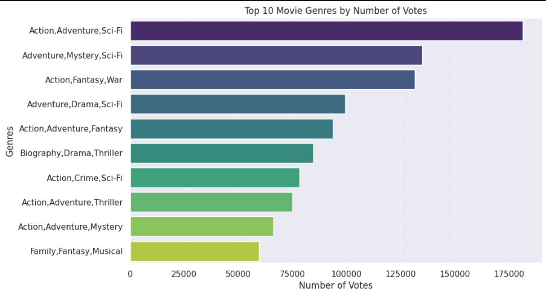
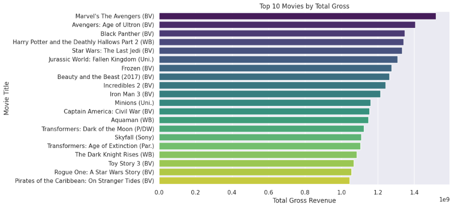
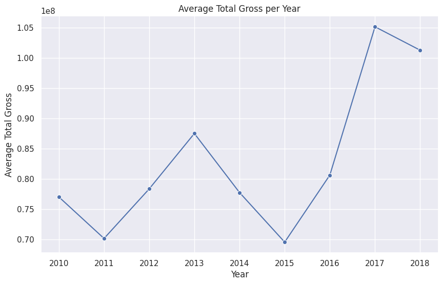

## 🎬 **Box Office Analysis for New Movie Studio**
Generating data-driven insights for launching a Film Studio.

## 📄 **Project Overview**

With rising investments in original film material, the entertainment sector has grown significantly.  Knowing the factors that contribute to box office success is essential as our company prepares to open a new film studio.
In order to identify trends pertaining to genres, budgets, release dates, and ratings that support strong box office returns, this study examines historical movie data.  The objective is to maximize audience engagement and profitability by directing strategic choices for film production and release.

## 💼 **Business Understanding**

Over the past decade, large media companies have shifted their focus towards original productions to capture and maintain viewer interest. To remain competitive, our company is launching a new movie studio targeting mainstream success.

### 🎯 **Business Problem**:

We need to identify which factors, such as genre, budget, and release timing, significantly influence box office performance, so we can invest in the right kind of movie production projects.

### 📝 **Project Objectives**:

1. Collect and investigate the box office database and datasets.

2. Determine which movie genres (e.g., action, adventure, family) have historically performed best.

3. Examine domestic vs international box office trends.

4. Perform Exploratory Data Analysis (EDA) and identify key attributes that influence box office success.

5. Offer clear, data-driven recommendations to support film production planning and market positioning.

✅ By achieving these objectives, the studio can minimize financial risks and make smarter investments in movie projects.

## 📁 **Data Understanding and Analysis**

### 🌐 **Data Sources**:

- **Box Office Mojo**: Box office gross revenue.

- **IMDb**: Genre, ratings, release dates, runtime, and other movie details.

- **The Numbers**: Budget and additional financial information.

### 🎞️ **Key Datasets Used**:

| Data Source          | Description                                                            |
| :-----------         |:----------                                                             |
|`bom.movie_gross.csv` | contains gross revenue (domestic and international) and studio details |
| `im.db`              | SQLite DB that contains movie data, ratings, number of votes, etc.     |
|`cleaned_dataset`     | Contains cleaned data (movie_df, movie_gross_df)                       |


🛢 **im.db SQLite database:**

- `movie_basics` table: Contains movie title, genre, runtime, and release year.

- `movie_ratings` table: Contains average IMDb ratings and number of votes.

### 💡 **Key Features Analyzed**:

- Movie Title

- Genre(s)

- Production Budget

- Release Year and Date

- IMDb Ratings

- Domestic and Worldwide Box Office Gross

### 🗂️ **Data Preparation and Cleaning**:

- Imported libraries such as Pandas, NumPy, SQLite3, and Seaborn to work with datasets.

- Extracted data by unzipping .zip and .gz files.

- Loaded structured data using SQLite3 (for .db files) and Pandas (for .csv files).

- Cleaned datasets by handling missing values, removing duplicates, and fixing formatting issues.

- Created new features where necessary (e.g., adding `total_gross` column).

### 📊 **Exploratory Data Analysis (EDA)**:
- Here we will do:

**Univariate Analysis (Single-Variable Analysis):**

This is examining one variable at a time to understand the distribution and characteristics of individual variables

Eg: Examined distributions of genres, ratings, and gross revenues.

**Bivariate Analysis  (Two-Variable Analysis):** 

This is examining relationships between two variables to help Identify patterns, relationships or differences between variables.

E.g: Compared genre vs gross earnings, number of votes vs genres, and gross revenue vs movie title.

**Correlation Matrix:**

Checked numerical relationships between number of votes, release year, ratings, and revenues.

### 📈 **Visualizations**: 

### **Top 10 Movie Genres by Number of Votes**


### **Top 20 Movies by Total Gross**


### **Average Gross Revenue over the years**


### ❓ **Hypothesis Testing**

Conduct statistical tests to validate or reject assumptions such as:

1. Do movies from major studios(eg Warner Bros,Disney)consistently earn higher box office revenue than smaller studios?

   **findings:** Movies from major studios(eg Warner Bros,Disney)consistently earn higher box office revenue than smaller studios

2. Do some genres consistently earn higher ratings than others?

   **Findings:** Yes, there is a significant difference in ratings between genres.

3. Do longer movies tend to receive higher ratings?

   **findings**: There is no significant correlation between movie runtime and average ratings.


### 🔎 **Key Insights Discovered**:

#### 1. 📺 **Optimal Genre Selection**:

**Genres that blend multiple popular themes dominate the box office.**

- The top genre — Adventure, Drama, Sport — has a significantly higher average domestic gross (over $400 million) compared to others.

- Other top-performing genres like Action, Adventure, Sci-Fi and Adventure, Drama, Sci-Fi also show that combining adventure with other strong themes (action, drama, sci-fi, sport) results in higher earnings.

- Meanwhile, single genres like Sci-Fi and Fantasy/Romance perform well but not as highly as the multi-theme combinations

### 2. 💲 **Ideal Budget Range**:
Movies with a budget between $50M–$150M tend to achieve strong financial performance. Extremely high or very low budget films are riskier unless supported by a strong brand or franchise.

### 3. 📅 **Best Time to Release**:
Movies released during Summer (June to August) and December holiday seasons perform significantly better, likely due to school vacations and festive periods when audiences are more available.

### 4. 🎬 **Movies released over the years**.
- The number of movies released each year increased slightly from 2010 to 2015, peaking around 390 movies in 2015.

- However, after 2015, there was a clear and sharp decline in the number of movies released each year, dropping drastically after 2017, with very few movies released in 2019.

- This suggests that after a period of steady production, something caused a major disruption or slowdown starting in 2016–2017, worsening into 2019.


## 📝 **Conclusion**
Through this box office analysis, we offer strategic guidance for the new studio to navigate and excel in the competitive film industry.

- **Genre Focus:** Invest in producing Action, Adventure, and Family-oriented films as they are highly popular and financially rewarding.

- **Smart Budgeting:** Allocate production budgets carefully to balance quality and profitability.

- **Release Timing:** Schedule movie releases during peak seasons—specifically, the summer months and December—for maximum audience reach and earnings potential.

🎯 By aligning film production choices with these insights, the studio will be well-positioned to launch strong, commercially successful movies that meet market demand and achieve sustained profitability.


### **Repository Structure**
```
dsc-phase-2-project/
├── 📂data
│   ├── cleaned_data
│   │   ├── cleaned_movie_dataset.csv                # Cleaned movie dataset (from DB)
│   │   └── cleaned_movie_gross_dataset.csv          # Cleaned movie gross dataset
│   ├── bom.movie_gross.csv                          # Original movie gross dataset
│   ├── im.db                                        # Original SQLite Database
├── 🖼️images
│   ├── average_total_gross_per_year.png             # average total gross image
│   ├── cinema_02.jpg                                # notebook intro image
│   ├── movies_by_total_gross.png                    # top 20 movies by total gross image
│   └── top_10_movie_genres.png                      # top 10 movie genres image
├── 🗂️zippedData
|   ├── bom.movie_gross.csv.gz                       # movie gross zipped folder
|   ├── im.db.zip                                    # SQLite database zipped folder
|   ├── rt.movie_info.tsv.gz                         # movie info zipped folder
|   ├── rt.reviews.tsv.gz                            # movie reviews zipped folder
|   ├── tmdb.movies.csv.gz                           # imdb movies zipped folder
|   ├── tn.movie_budgets.csv.gz                      # movie budgets zipped folder
├── 🔎.gitattributes                                # tracks the im.db file using git lfs
├── 📄.gitignore                                    # contains files ignored by git
├── 📖README.md                                     # project README
├── 📘index.ipynb                                   # main jupyter notebook
├── 📝reports
│   ├── CRISPDM_Documentation.docx                  # CRISPDM document
│   ├── Presentation.pdf                            # project slide deck
```

### 📋 **Trello Board**
The link to our trello board is embedded below:

[Trello Project Management Board](https://trello.com/b/pMBim3Vp/group-1-phase-2-project)

### ℹ️ **For More Information**
Check the full analysis in the [Jupyter Notebook](https://github.com/Patricknmaina/dsc-phase-2-project/blob/main/index.ipynb)

### 👤**Contributors**
- Patrick Maina (Group Leader): [Email](patrick.maina3@student.moringaschool.com)

- Teresia Njoki: [Email](
teresia.njoki@student.moringaschool.com)

- Christine Ndungu: [Email](
christine.ndungu@student.moringaschool.com)

- George Nyandusi: [Email](
george.nyandusi@student.moringaschool.com)


